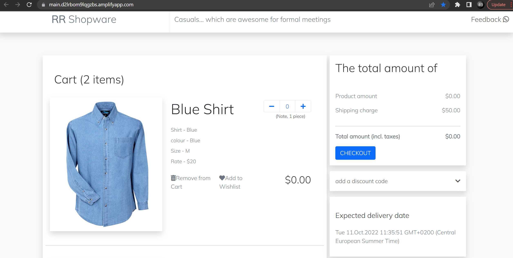
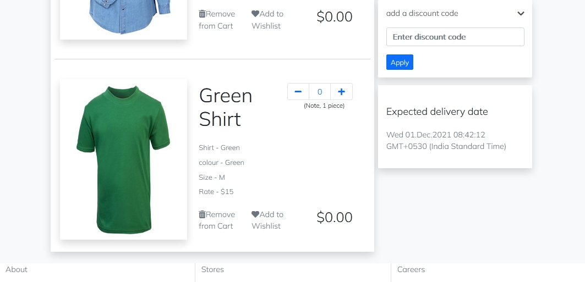
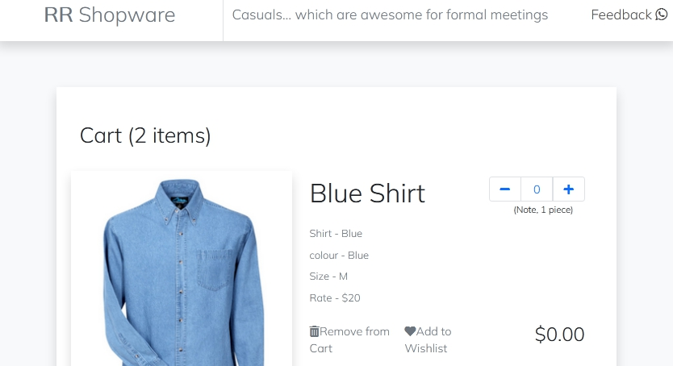
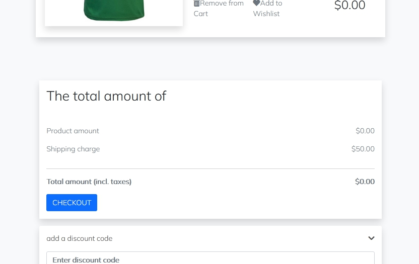
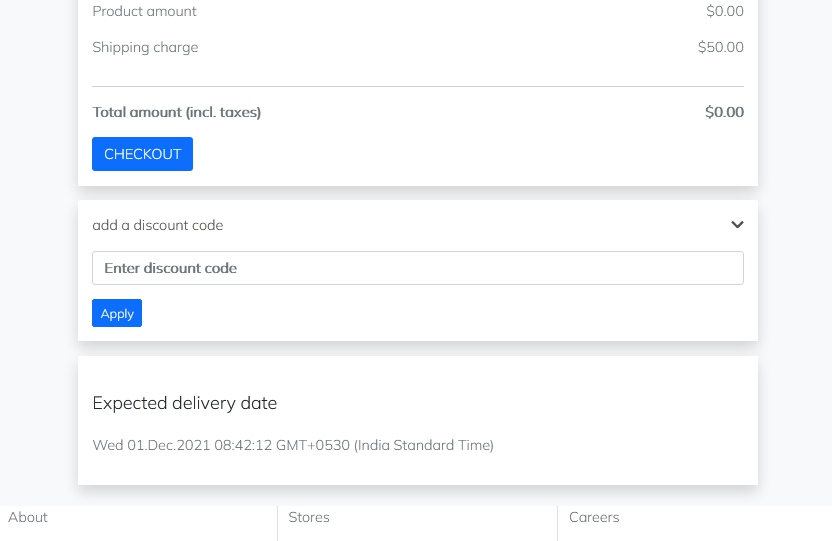
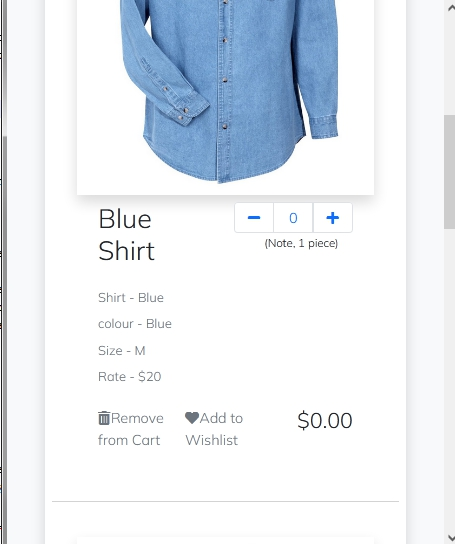
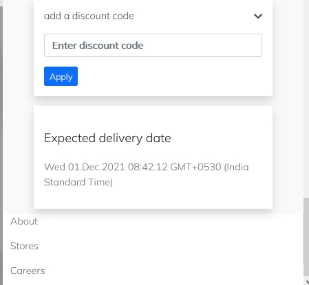

# RR Shopware
## Where Casuals meet Formals

This frontend project features a proof of concept of modern UI design. It is a lean and intuitive user interface.
The technologies used to build it are: modern Vanilla Javascript (ECMAScript 8), Cascading StyleSheets (CSS), HyperText Markup Language (HTML) and Bootstrap.

Visit us at:
https://main.d2lrbom9lqgzbs.amplifyapp.com/
OR
https://rrshops.netlify.app/

## RR Shopware site built with:
- Vanilla JavaScript / ECMAScript (ES6+)
- CSS
- HTML
- Bootstrap 5

## Shopping cart page with functionalities:
- Add item to cart
- Remove item from cart
- Discount code
- Displaying expected delivery date
- Links to contact us/me through various channels including WhatsApp

## Docker Repository for Container Images
https://hub.docker.com/r/i50729/rrshops

## Screenshots

- ### Medium Viewport

  
Main and Header  

  
Main, Discount Code Dialog and Footer  

- ### Responsive view on Viewports Smaller than Medium

  
Main and Header  

  
Main, Checkout Dialog and Discount Code Dialog  

Discount Code Dialog and Footer  

- ### Responsive view on Small Viewports

  
Cart Items  

  
Discount Code Dialog, Delivery Date Dialog and Footer  

## Thanks for reviewing. Feedback is welcome!
